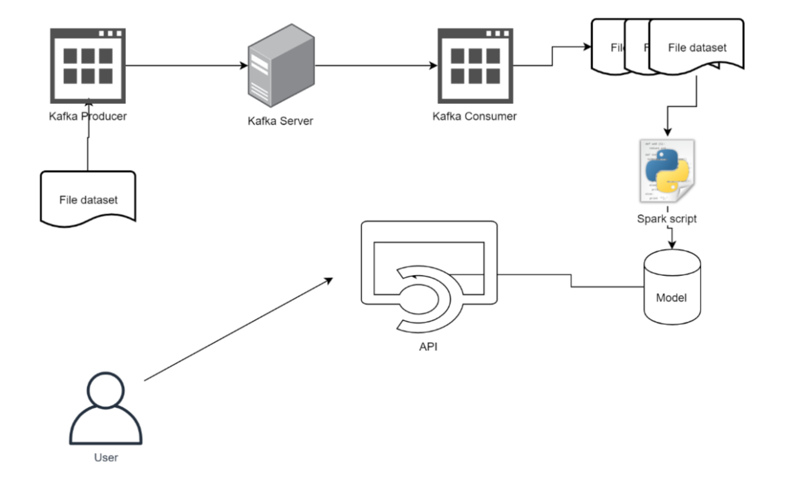
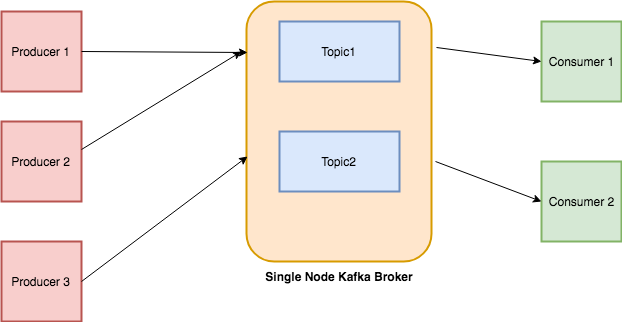
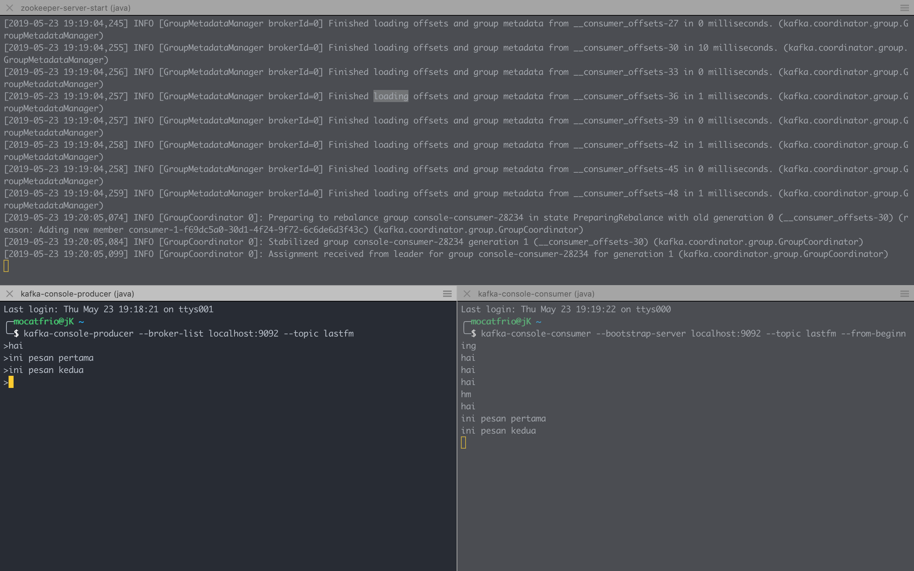

# Final Project : Recommendation System on Data Stream using Kafka, Spark, and Flask 

## Table of Contents
- [Final Project : Recommendation System on Data Stream using Kafka, Spark, and Flask](#final-project--recommendation-system-on-data-stream-using-kafka-spark-and-flask)
  - [Table of Contents](#table-of-contents)
  - [1. Description](#1-description)
    - [1.1 Architecture](#11-architecture)
    - [1.2 Requirements](#12-requirements)
    - [1.3 Dataset](#13-dataset)
  - [2. Implementation](#2-implementation)
    - [2.1 Stream-Processing](#21-stream-processing)
      - [2.1.1 Installation](#211-installation)
      - [2.1.2 Build Producer and Consumer Apps](#212-build-producer-and-consumer-apps)
    - [2.2 Recommender Engine](#22-recommender-engine)
    - [2.2 API](#22-api)
  - [References](#references)

## 1. Description 
### 1.1 Architecture 
This final project has the following architecture:
    


Based on the architecture above, this system has three main components, that is:
  1. **Apache Zookeeper and Apache Kafka**. **Zookeeper** as centralized service for distributed systems, while **Kafka** as stream-processing software platform. Kafka relies on Zookeeper.
  2. **Apache Spark**, as analytics engine for big data processing. Spark script is used to processing and analyze datasets into Models.
  3. **Flask**, as microframework to build APIs that can be accessed by User.

### 1.2 Requirements
These are some requirements in this final project:
1. Apache Zookeeper 3.4.13
2. Apache Kafka 2.2.0
3. Apache Spark 2.4.0 Binary
4. Flask
5. Postman (API testing)
6. Some Python libraries:
    - PySpark 2.4.2 (Apache Spark Python API)
    - Numpy 1.16.3
    - Kafka-Python

### 1.3 Dataset
* Dataset's name: [LastFM Dataset](https://grouplens.org/datasets/hetrec-2011/)
* This dataset contains social networking, tagging, and music artist listening information from a set of 2K users from Last.fm online music system (http://www.last.fm). Further description can be found here: http://files.grouplens.org/datasets/hetrec2011/hetrec2011-lastfm-readme.txt
* This final project only uses these two kinds of data i.e. **artists.csv** and **user_artists.csv**
* Dataset's extension is **dat**, so it must be converted first into csv using my [**convert.py**](app/convert.py) script

## 2. Implementation
Implementation will be divided into three parts.

### 2.1 Stream-Processing
* Stream-processing is implemented using Kafka and Zookeeper.
* Kafka works as follows:

    

* There are three main parts of Kafka:
    1. **Topics** : Category or feed name to which stream of records are published. The messages are stored in key-value format. The output of one message could be an input of the other for further processing.
    2. **Producers** : Apps that responsible to publish data into Kafka system. Producers can publish data on the certain topic they choose.
    3. **Consumers** : Apps that responsible to utilize the messages published into topics. Consumers get subscribed to the topic they choose and consumes data.

#### 2.1.1 Installation
1. First, install Kafka on Mac using Homebrew:

    ```bash
    brew install kafka
    ```
    It will automatically installing Zookeeper as Kafka's dependency.
    ```bash
    ...
    ==> Installing dependencies for kafka: zookeeper
    ==> Installing kafka dependency: zookeeper
    ==> Downloading https://homebrew.bintray.com/bottles/zookeeper-3.4.13.mojave.bot
    ==> Downloading from https://akamai.bintray.com/d1/d1e4e7738cd147dceb3d91b32480c
    ######################################################################## 100.0%
    ==> Pouring zookeeper-3.4.13.mojave.bottle.tar.gz
    ==> Caveats
    To have launchd start zookeeper now and restart at login:
    brew services start zookeeper
    Or, if you don't want/need a background service you can just run:
    zkServer start
    ==> Summary
    🍺  /usr/local/Cellar/zookeeper/3.4.13: 244 files, 33.4MB
    ==> Installing kafka
    ==> Downloading https://homebrew.bintray.com/bottles/kafka-2.2.0.mojave.bottle.t
    ==> Downloading from https://akamai.bintray.com/42/429ba5063b009ad8273be2b07c41e
    ######################################################################## 100.0%
    ==> Pouring kafka-2.2.0.mojave.bottle.tar.gz
    ...
    ```
2. Run the Zookeeper server and Kafka broker server by the following line:
   ```bash
   $ zookeeper-server-start /usr/local/etc/kafka/zookeeper.properties & kafka-server-start /usr/local/etc/kafka/server.properties
   ```
   It will display lots of line on the terminal, but if the following lines appear, it means Zookeeper and Kafka server are running properly.

   * Zookeeper server logs
        ```bash
        ...
        [2019-05-19 14:45:13,097] INFO Using org.apache.zookeeper.server.NIOServerCnxnFactory as server connection factory (org.apache.zookeeper.server.ServerCnxnFactory)
        [2019-05-19 14:45:13,130] INFO binding to port 0.0.0.0/0.0.0.0:2181 (org.apache.zookeeper.server.NIOServerCnxnFactory)  
        ```
   * Kafka server logs
        ```bash
        ...
        [2019-05-19 14:45:15,780] INFO Kafka version: 2.2.0 (org.apache.kafka.common.utils.AppInfoParser)
        [2019-05-19 14:45:15,780] INFO Kafka commitId: 05fcfde8f69b0349 (org.apache.kafka.common.utils.AppInfoParser)
        [2019-05-19 14:45:15,782] INFO [KafkaServer id=0] started (kafka.server.KafkaServer)
        ```
3. Create a Kafka topic by this following line:
    ```bash
    $ kafka-topics --create --zookeeper localhost:2181 --replication-factor 1 --partitions 1 --topic lastfm
    ```
    In this final project, I'll make a topic named **"lastfm"**.
4. To test the topic created, initialize Producer console that will listen to localhost at port 9092 at topic "lastfm".
    ```bash
    $ kafka-console-producer --broker-list localhost:9092 --topic lastfm
    ```
    
    After that, initialize Consumer console that will listen to bootstrap server localhost at port 9092 at topic "lastfm" from beginning.

    ```bash
    $ kafka-console-consumer --bootstrap-server localhost:9092 --topic lastfm --from-beginning
    ```
    
    

#### 2.1.2 Build Producer and Consumer Apps
Next, we will build producer and consumer apps that accesing Kafka in Python using **Kafka-Python**, the open-source Python libraries. 

There are some rules in this final project:
1. **Kafka Producers** will send data per-line to Kafka Server as if it is streaming. This process can be done by adding pause or sleep randomly, so, data will not sent directly.
2. **Kafka Consumers** will receive data from Kafka server and store it in some batch. Batch can be determined based on:
   * Number of data received
   * Sliding window time

Here the steps:

1. Install Kafka-Python using Pip
    ```bash
    # using Python3
    $ pip3 install kafka-python
    ```
2. 
    

### 2.2 Recommender Engine

### 2.2 API

## References
* https://medium.com/@Ankitthakur/apache-kafka-installation-on-mac-using-homebrew-a367cdefd273
* https://towardsdatascience.com/getting-started-with-apache-kafka-in-python-604b3250aa05