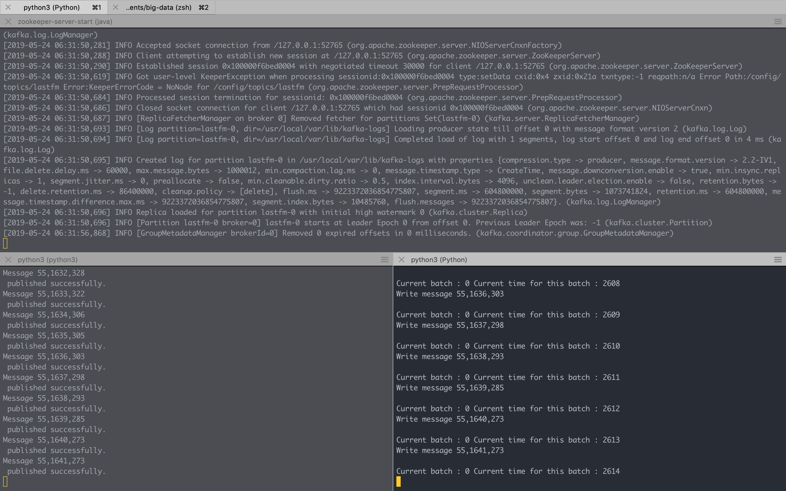

# Final Project

## 1. Description 
### 1.1 Architecture 
Final project has the following architecture:
    


Based on architecture above, this system has four main components, that is:
  1. **Apache Zookeeper**, as centralized service for distributed systems.
  2. **Apache Kafka**, as stream-processing software platform. It relies on Zookeeper. Kafka has three parts, i.e. Producer, Server, and Consumer.
  3. **Apache Spark**, as analytics engine for big data processing. Spark script is used to processing and analyze datasets into Models.
  4. **Flask**, as microframework to build APIs that can be accessed by User.

### 1.2 Requirements
 1. Apache Spark 2.4.0 Binary
 2. PySpark 2.4.2 (Apache Spark Python API)
 3. Jupyter Notebook 
 4. Numpy 1.16.3
 5. Flask
 6. Postman
 7. Apache Zookeeper
 8. Apache Kafka

### 1.3 Dataset
coming soon

## 2. Implementation
Implementation will be divided into three parts.

### 2.1 Stream-Processing
* Stream-processing is implemented using Kafka and Zookeeper.
* Kafka works as follows:

    

* There are three main parts of Kafka:
    1. **Topics** : Category or feed name to which stream of records are published. The messages are stored in key-value format. Each message is assigned a sequence, called Offset. The output of one message could be an input of the other for further processing.
    2. **Producers** : The apps responsible to publish data into Kafka system. They publish data on the topic of their choice.
    3. **Consumers** : The apps responsible to utilize the messages published into topics. A consumer gets subscribed to the topic of its choice and consumes data.

#### 2.1.1 Installation and Running
1. First, install Kafka on Mac using Homebrew:

    ```bash
    brew install kafka
    ```
    It will automatically installing Zookeeper as Kafka's dependency.
    ```bash
    ...
    ==> Installing dependencies for kafka: zookeeper
    ==> Installing kafka dependency: zookeeper
    ==> Downloading https://homebrew.bintray.com/bottles/zookeeper-3.4.13.mojave.bot
    ==> Downloading from https://akamai.bintray.com/d1/d1e4e7738cd147dceb3d91b32480c
    ######################################################################## 100.0%
    ==> Pouring zookeeper-3.4.13.mojave.bottle.tar.gz
    ==> Caveats
    To have launchd start zookeeper now and restart at login:
    brew services start zookeeper
    Or, if you don't want/need a background service you can just run:
    zkServer start
    ==> Summary
    🍺  /usr/local/Cellar/zookeeper/3.4.13: 244 files, 33.4MB
    ==> Installing kafka
    ==> Downloading https://homebrew.bintray.com/bottles/kafka-2.2.0.mojave.bottle.t
    ==> Downloading from https://akamai.bintray.com/42/429ba5063b009ad8273be2b07c41e
    ######################################################################## 100.0%
    ==> Pouring kafka-2.2.0.mojave.bottle.tar.gz
    ...
    ```
2. Run the Zookeeper server and Kafka broker server by the following line:
   ```bash
   $ zookeeper-server-start /usr/local/etc/kafka/zookeeper.properties & kafka-server-start /usr/local/etc/kafka/server.properties
   ```
   It will display lots of line on the terminal, but if the following lines appear, it means Zookeeper and Kafka server are running properly.

   * Zookeeper server logs
        ```bash
        ...
        [2019-05-19 14:45:13,097] INFO Using org.apache.zookeeper.server.NIOServerCnxnFactory as server connection factory (org.apache.zookeeper.server.ServerCnxnFactory)
        [2019-05-19 14:45:13,130] INFO binding to port 0.0.0.0/0.0.0.0:2181 (org.apache.zookeeper.server.NIOServerCnxnFactory)  
        ```
   * Kafka server logs
        ```bash
        ...
        [2019-05-19 14:45:15,780] INFO Kafka version: 2.2.0 (org.apache.kafka.common.utils.AppInfoParser)
        [2019-05-19 14:45:15,780] INFO Kafka commitId: 05fcfde8f69b0349 (org.apache.kafka.common.utils.AppInfoParser)
        [2019-05-19 14:45:15,782] INFO [KafkaServer id=0] started (kafka.server.KafkaServer)
        ```
3. Create a Kafka topic by this following line:
    ```bash
    $ kafka-topics --create --zookeeper localhost:2181 --replication-factor 1 --partitions 1 --topic test
    ```
    For example, we want to make a topic named "test" just for test Kafka broker server.
4. Initialize Producer console which will listen to localhost at port 9092 at topic test:
    ```bash
    kafka-console-producer --broker-list localhost:9092 --topic test
    ```
5. Initialize Consumer console which will listen to bootstrap server localhost at port 9092 at topic test from beginning:
    ```bash
    kafka-console-consumer --bootstrap-server localhost:9092 --topic test --from-beginning
    ```



#### 2.1.2 Build Apps
Next, we will build producer and consumer apps that accesing Kafka in Python. There are multiple Python libraries available to use, one of them is **Kafka-Python**, the open-source Python libraries.

1. Install Kafka-Python using Pip

    ```bash
    # using Python3
    $ pip3 install kafka-python
    ```
2. 
    

### 2.2 Recommender Engine
### 2.2 API


## References
* https://medium.com/@Ankitthakur/apache-kafka-installation-on-mac-using-homebrew-a367cdefd273
* https://towardsdatascience.com/getting-started-with-apache-kafka-in-python-604b3250aa05