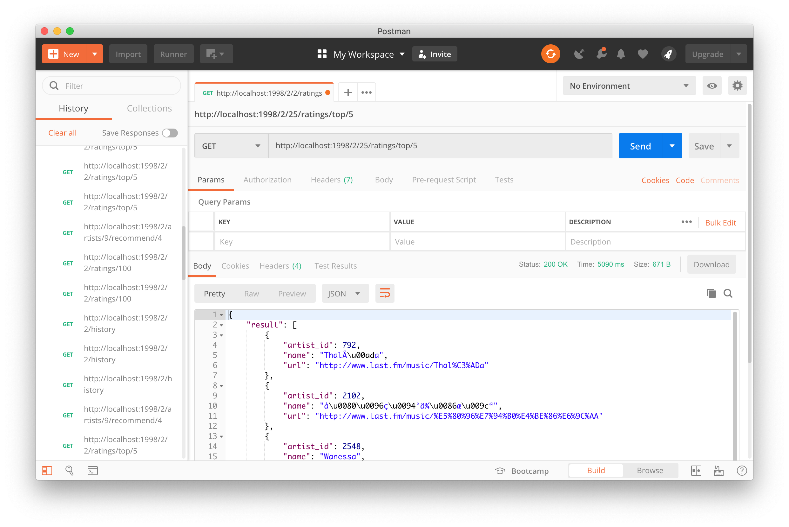

# Music Recommendation System API

## Description
This application has three main files, that is:

1. **server.py** : initialises a **CherryPy webserver** after creating a Spark context and Flask web app
2. **app.py** : defines a **RESTful-like API** around the engine
3. **engine.py** :  defines the recommendation engine, wrapping inside all the Spark related computations

## Features
Music Recommendation System has some features below:
1. Showing some music artist recommendations for a user
2. Showing some users who get an artist as recommendation 
3. Predicting a user listen the music of an artist
4. Showing listening count history by a user

## How to Run
1. If you want to use **Virtualenv**, make it first by
    ```python
    virtualenv -p python3 venv
    ```
    Then, activate it
    ```python
    source venv/bin/activate
    ```
2. Install all Flask application's dependencies by
    ```python
    pip3 install -r req.txt
    ```
3. Run `start_server.sh` script that contains 
    ```bash
    /usr/local/spark/bin/spark-submit --master local --total-executor-cores 14 --executor-memory 6g server.py
    ```
    by 
    ```bash
    bash start_server.sh
    ```
4. Wait until application processing is complete and give the `Engine Started !` output.

    

## Some End Points Can be Accessed
### 1. **http://\<SERVER_IP\>:1998/\<model_id\>/\<user_id\>/ratings/top/\<number_of_artists\>** [GET]
An end points to get some music artist recommendations as many as `<number_of_artists>` for a user based on its `<user_id>`.

For example:
```
http://localhost:1998/2/25/ratings/top/5
```



If the model used is different, the results will be different too.


### 2. **http://\<SERVER_IP\>:1998/\<model_id\>/artists/\<artist_id\>/recommend/\<number_of_users\>** [GET]
An end point to get some users as many as `<number_of_users>` who get an artist as recommendation based on its `<artist_id>`.

For example:
```
http://localhost:1998/2/artists/9/recommend/4
```


### 3. **http://<SERVER_IP>:1998/\<model_id\>/\<user_id\>/listen/\<artist_id\>** [GET]
An end point to predict a user listening music of an artist based on `<user_id>` and `<artist_id>`.

For example:
```
http://localhost:1998/1/43/listen/10
```


### 4. **http://<SERVER_IP>:1998/\<model_id\>/\<user_id\>/history** [GET]

An end point to get listening count history of a user based on `<user_id>`. 

For example:
```
http://localhost:1998/2/43/history
```

