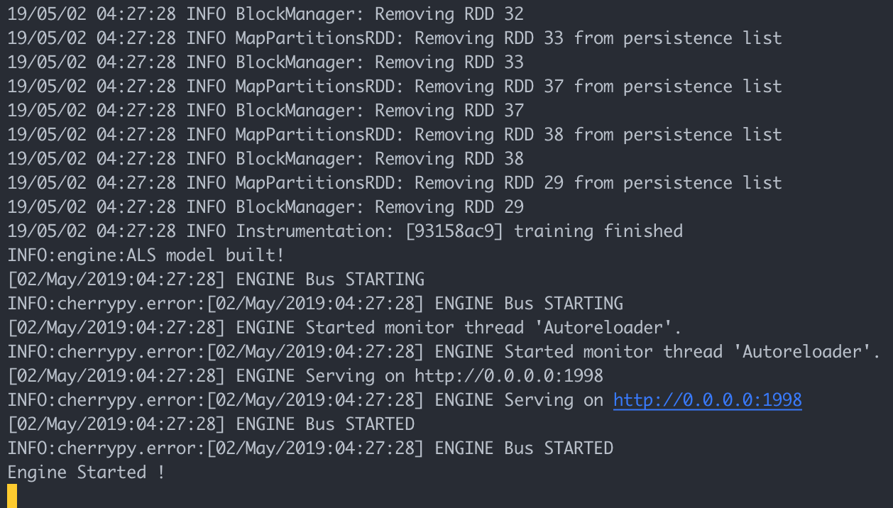
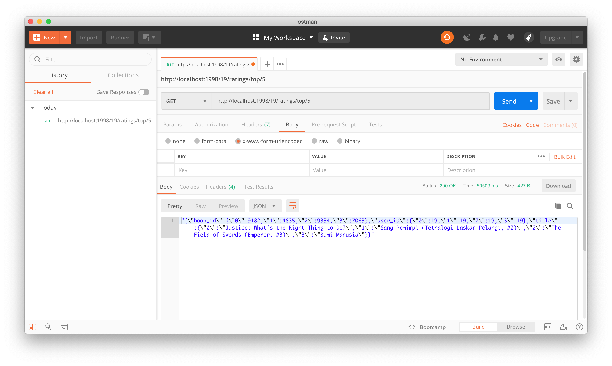
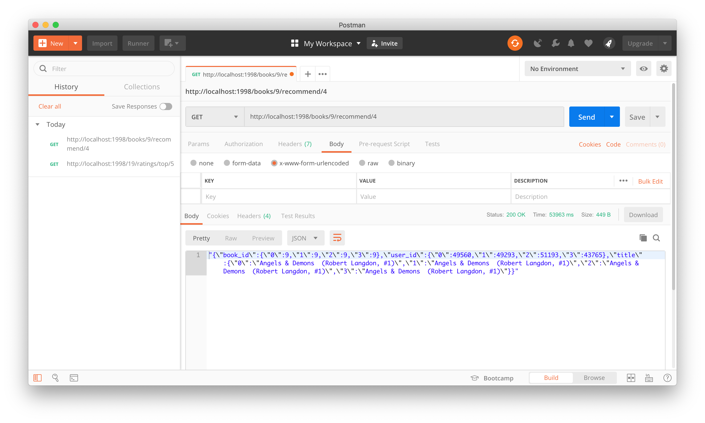
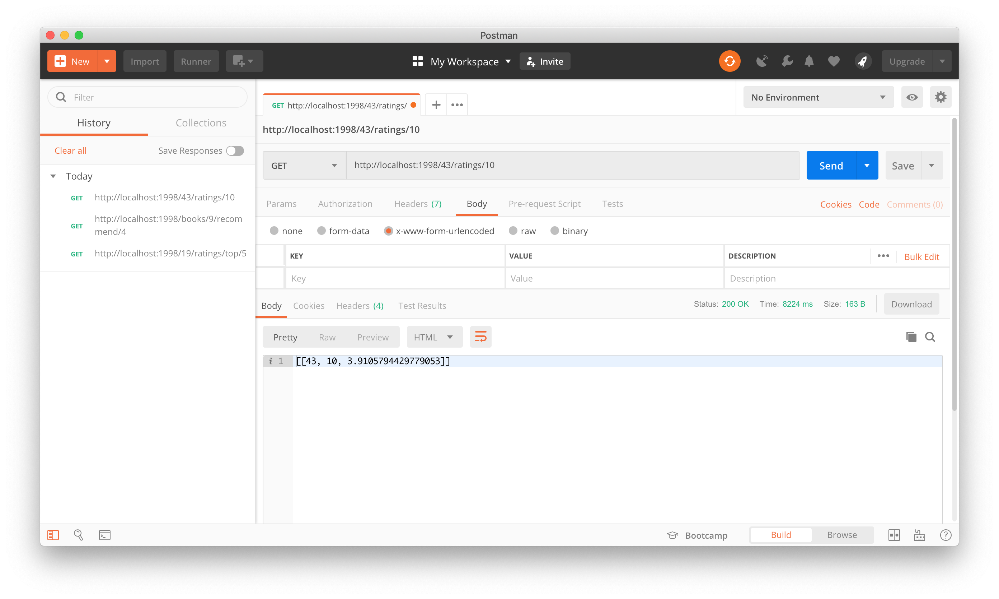
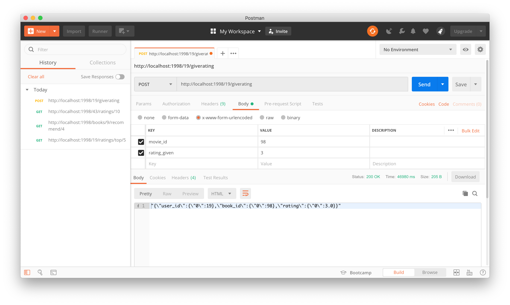
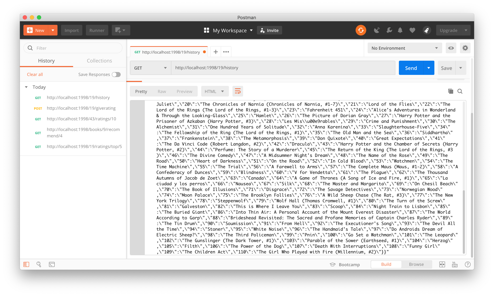

## Part 2 : Build a web-service on top of Spark models using Flask
# Book Recommendation System using Apache Spark and Flask

## Description
This application has three main files, that is:

1. **server.py** : initialises a **CherryPy webserver** after creating a Spark context and Flask web app
2. **app.py** : defines a **RESTful-like API** around the engine
3. **engine.py** :  defines the recommendation engine, wrapping inside all the Spark related computations

## Features
Book Recommendation System has some features below:
1. Showing some book recommendations for a user
2. Showing some users who get a book as recommendation 
3. Predicting a user give rate for a book
4. Giving rate for a book
5. Showing rates history by a user

Output data of this API are in JSON form.

## How to Run
1. If you want to use **Virtualenv**, make it first by
    ```python
    virtualenv -p python3 venv
    ```
    Then, activate it
    ```python
    source venv/bin/activate
    ```
2. Install all Flask application's dependencies by
    ```python
    pip3 install -r req.txt
    ```
3. Run `start_server.sh` script that contains 
    ```bash
    /usr/local/spark/bin/spark-submit --master local --total-executor-cores 14 --executor-memory 6g server.py
    ```
    by 
    ```bash
    bash start_server.sh
    ```
4. Wait until application processing is complete and give the `Engine Started !` output.

    

## Some URL/End Points Can be Accessed
1. **[GET]** `http://<SERVER_IP>:1998/<user_id>/ratings/top/<book_count>`

    An end points to get some book recommendations as many as `<book_count>` for a user based on its `<user_id>`.

    For example:
    `http://localhost:1998/19/ratings/top/5`

    

2. **[GET]** `http://<SERVER_IP>:1998/books/<book_id>/recommend/<user_count>`

    An end point to get some users as many as `<user_count>` who get a book as recommendation based on its `<book_id>`.

     For example:
    `http://localhost:1998/books/9/recommend/4`

    

3. **[GET]** `http://<SERVER_IP>:1998/<user_id>/ratings/<book_id>`

    An end point to predict a user give rate for a book based on `<user_id>` and `<book_id>`.

    For example:
    `http://localhost:1998/43/ratings/10`

    

4. **[POST]** `http://<SERVER_IP>:1998/<user_id>/giverating`

    An end point to give rate for a book based on `<user_id>`.

    For example:
    `http://localhost:1998/19/giverating`

    

5. **[GET]** `http://<SERVER_IP>:1998/<user_id>/history`

    An end point to get rates history of a user based on `<user_id>`. 

    For example:
    `http://localhost:1998/19/history`
    
    